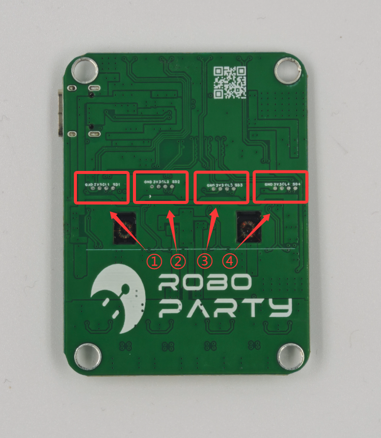

# Roboto_Usb2Can_V1.0 - USB to 4-Channel CAN Communication Module

[English](./README.md) | **[🇨🇳 中文](./README_cn.md)**

## 📖 Overview

**Roboto_Usb2Can_V1.0** is a highly integrated communication conversion device developed by **RoboParty**.

Designed primarily for robot control systems, this module converts USB signals from a host computer (such as an Orange Pi 5 Plus or other Linux devices) into **4 independent CAN bus signals**, enabling efficient control of actuators like servo motors.

> ⚠️ **Note:** This device currently only supports recognition and usage on **Linux systems**.

## 📂 Repository Structure

This repository contains all files required to manufacture and use this module:

- **PCB Manufacturing Files (Gerber):** `01_Gerber/`
- **BOM & Coordinate Files:** `02_Assembly/`
- **Firmware Files:** `03_Firmware/`
- **Detailed Documentation:** `00_Docs/`

## 🔌 Interfaces

### 1. Hardware Interface Layout

| No. | Name | Type | Description |
| :--- | :--- | :--- | :--- |
| **①/④** | **Mounting Holes** | Mechanical | Standard mounting holes |
| **②** | **Flashing LEDs** | LED | Status indicators for the 4 backend channels |
| **③** | **USB-C** | Data/Power | Connects to Host (Linux), 5V Input |
| **④** | **CAN Interfaces** | GH1.25 | 4-channel CAN bus output (4L, 4H, 3L, 3H...) |

### 2. Recommended Connection Topology
For easier management, we recommend connecting the robot joints in the following order:

- **CAN 1:** Left Leg (including Waist)
- **CAN 2:** Right Leg
- **CAN 3:** Left Arm
- **CAN 4:** Right Arm

## 🛠️ Firmware Flashing Guide

There are 4 sets of SWD programming interfaces reserved on the back of the device. You will need to use **1.25mm programming probes (pogo pins)** with an ST-Link or similar tool.

### Flashing Steps:
1.  **Download Firmware:** Get [RoboParty-HubUsb2Can_1.00.bin](03_Firmware/RoboParty-HubUsb2Can_1.00.bin).
2.  **Connect Programmer:** The pinout from left to right is: `GND`, `3V3`, `CLK`, `DIO`.
3.  **Sequential Flashing:** Please flash the firmware to the **4 programming ports** on the back one by one (each port corresponds to one CAN control chip).

## ⚠️ Precautions

1.  **Power Safety:**
    * **5V Power Supply ONLY.** Do not connect higher voltages.
    * Do not forcibly insert the Type-C cable in reverse.
2.  **Termination Resistors:**
    * The CAN bus specification requires a **120Ω termination resistor** at the end of each bus.
    * If your servo motors have internal resistors, no extra action is needed; otherwise, you must add a parallel resistor at the end of the chain.
3.  **Environmental Requirements:**
    * Avoid contact with water, conductive dust, or metal debris to prevent short circuits.

## 🏭 Manufacturing Downloads

If you need to manufacture this module yourself, please download the following files:

* **Gerber Files (PCB Fab):** [Roboto_Usb2Can_V1.0.rar](01_Gerber/Roboto_Usb2Can_V1.0.rar)
* **Bill of Materials (BOM):** [HUB-USB2CAN_Bom.xlsx](02_Assembly/HUB-USB2CAN_Bom.xlsx)
* **Pick & Place Coordinates (CPL):** [PickAndPlace.xlsx](02_Assembly/PickAndPlace_HUB_USBTOCAN_V1_0.xlsx)

---
**Tech Support:** If you encounter technical issues, please contact the RoboParty technical team.